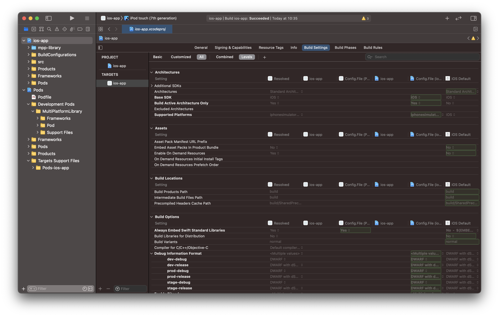
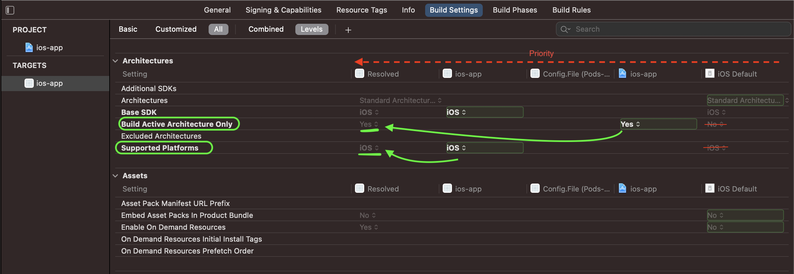
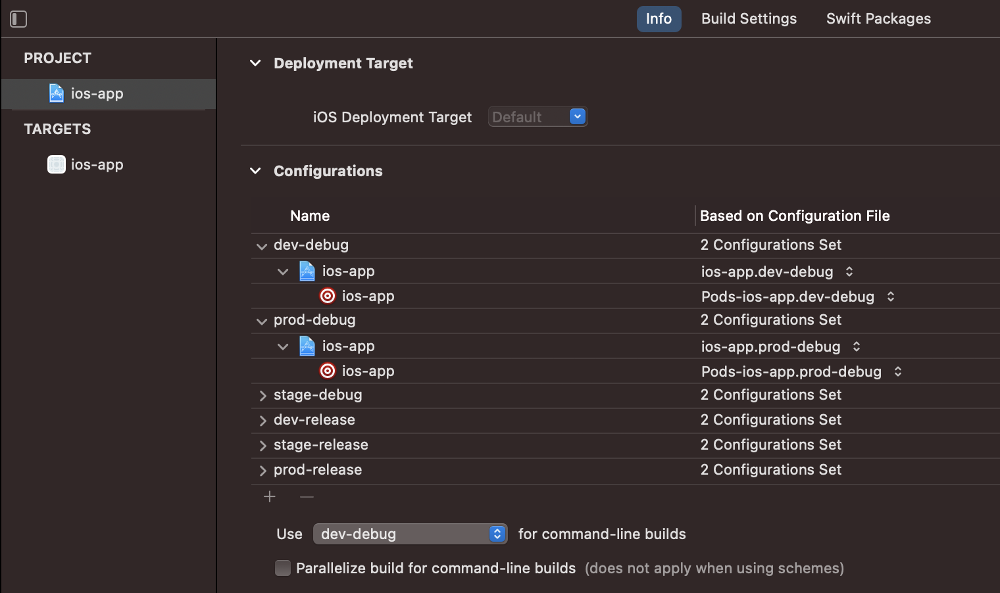
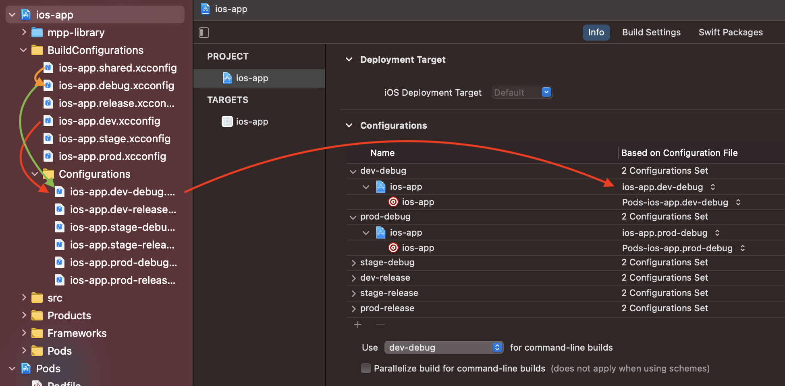

#  Конфигурации сборки проекта


## О конфигурациях 

Обычно практики разработки предписывают строгое разделение конфигураций от кода. Тем не менее, большинство iOS-разработчиков пытаются совместить эти рекомендации с рабочим процессом сборки Xcode.



Перейдя во вкладку `Build Settigs`, вы увидите сотни настроек сборки, распределенных по слоям проекта, целям и конфигурациям, и это не говоря об остальных вкладках.


## Как это устроено

В этой многоуроневой таблице вы можете увидеть столбцы - это слои проекта. 
Они расположены в приоритетном порядке справа налево. 



Включить такое отображение таблицы вы можете нажав на кнопку `Levels`.


Чтобы указать для какой-то конфигурации файл, который ее настраивает, достаточно просто в `PROJECT_NAME.xcodeproj -> Project -> PROJECT_NAME -> Configurations` указать файл с расширением `xcconfig`.


Перейдем к заполнению config-файла:

```bash
SDKROOT = iphoneos
```

Узнать название настройки вы можете прямо в Xcode'е в разделе `Quick Help` бокового меню, ну или по этой [ссылке](https://xcodebuildsettings.com).


Чтобы понять, что какую-то настройку мы получили именно из файла конфигурации, а не из файла проекта, необходимо просто посмотреть на уровни таблицы - конечная настройка выделяется другим цветом:


Теперь достаточно удалить это поле в файле конфигурации проекта нажатием Backspace ⌫.


Как мы видим конечным параметром стал именно наш параметр из файла.

:::important

Рекомендуем перенести все настройки сборки проекта в файлы конфигурации, чтобы хранить настройки в одном месте, избавиться от дублирования и проще проводить ревью изменений в git'е.

:::


## Как делаем мы
На наших проектах мы используем 6 типов конфигураций сборки, их вы можете найти в настройках проекта:



В целях комфортного управления всеми этими параметрами для каждой конфигурации сборки, мы вынесли все настройки в отдельные файлы, и удалили эти поля из файла проекта.

Все они находятся в директории `BuildConfigurations/Cofigurations`.



Например, если рассмотрим конфигурацию `dev-debug`, то можно заметить, что она базируется на файле конфигурации `ios-app.dev-debug.xcconfig`. 

Посмотрим что в нем:
```cpp
#include "../ios-app.dev.xcconfig"
#include "../ios-app.debug.xcconfig"
```

Он комбинирует настройки из файла `ios-app.dev.xcconfig` и `ios-app.debug.xcconfig`. 

Заглянем в первый из них:
```cpp
// add "dev" params
```

Как мы видим настроек для `dev`-конфигураций пока нет, но их можно добавить в этот файл.

Во втором же файле можно увидеть следующее:

```cpp
#include "ios-app.shared.xcconfig"

ENABLE_TESTABILITY = YES
GCC_PREPROCESSOR_DEFINITIONS = $(inherited) BATTLE_ERROR_DETAIL_OUTPUT=1 SR_ENABLE_LOG=1 DEBUG=1
MTL_ENABLE_DEBUG_INFO = YES
ONLY_ACTIVE_ARCH = YES
OTHER_SWIFT_FLAGS = $(inherited) -D DEBUG -Xfrontend -debug-time-function-bodies -Xfrontend -warn-long-function-bodies=500
SWIFT_OPTIMIZATION_LEVEL = -Onone
DEBUG_INFORMATION_FORMAT = dwarf
ENABLE_BITCODE = NO
// add "debug" params
```

Он содержит параметры сборки для всех `debug`-конфигураций проекта, а так же импортирует параметры из `ios-app.shared.xcconfig`:

```cpp
SDKROOT = iphoneos
SUPPORTED_PLATFORMS = iphoneos, iphonesimulator
IPHONEOS_DEPLOYMENT_TARGET = 12.0
SWIFT_VERSION = 5.0
INFOPLIST_FILE = ${SRCROOT}/src/Info.plist
PRODUCT_BUNDLE_IDENTIFIER = org.example.app
PRODUCT_NAME = mokoApp
CLANG_ENABLE_OBJC_WEAK = YES
ASSETCATALOG_COMPILER_APPICON_NAME = AppIcon
ONLY_ACTIVE_ARCH = YES
DEFINES_MODULE = YES
CURRENT_PROJECT_VERSION = 1.0
GCC_NO_COMMON_BLOCKS = YES
ENABLE_STRICT_OBJC_MSGSEND = YES
CLANG_WARN_BLOCK_CAPTURE_AUTORELEASING = YES
CLANG_WARN_EMPTY_BODY = YES
CLANG_WARN_BOOL_CONVERSION = YES
CLANG_WARN_CONSTANT_CONVERSION = YES
GCC_WARN_64_TO_32_BIT_CONVERSION = YES
CLANG_WARN_ENUM_CONVERSION = YES
CLANG_WARN_INT_CONVERSION = YES
CLANG_WARN_NON_LITERAL_NULL_CONVERSION = YES
CLANG_WARN_INFINITE_RECURSION = YES
GCC_WARN_ABOUT_RETURN_TYPE = YES
CLANG_WARN_QUOTED_INCLUDE_IN_FRAMEWORK_HEADER = YES
CLANG_WARN_STRICT_PROTOTYPES = YES
CLANG_WARN_COMMA = YES
GCC_WARN_UNINITIALIZED_AUTOS = YES
CLANG_WARN_UNREACHABLE_CODE = YES
GCC_WARN_UNUSED_FUNCTION = YES
GCC_WARN_UNUSED_VARIABLE = YES
CLANG_WARN_RANGE_LOOP_ANALYSIS = YES
CLANG_WARN_SUSPICIOUS_MOVE = YES
CLANG_WARN__DUPLICATE_METHOD_MATCH = YES
CLANG_WARN_OBJC_LITERAL_CONVERSION = YES
CLANG_WARN_DEPRECATED_OBJC_IMPLEMENTATIONS = YES
GCC_WARN_UNDECLARED_SELECTOR = YES
CLANG_WARN_OBJC_IMPLICIT_RETAIN_SELF = YES
```

Это общие параметры для любой конфигурации проекта.

:::note

Аналогично устроены и другие конфигурации в проекте. Это сделано для удобства настройки конфигураций и для исключения перезаписывания параметров сборки.

:::

## Материалы

- [Документация - Xcode Build Settings](https://xcodebuildsettings.com)
- [Статья - Xcode Build Configuration Files](https://nshipster.com/xcconfig/)